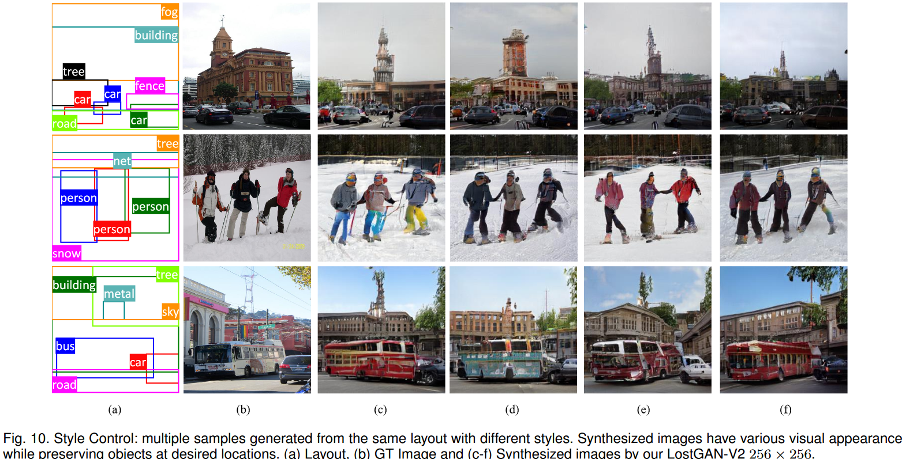
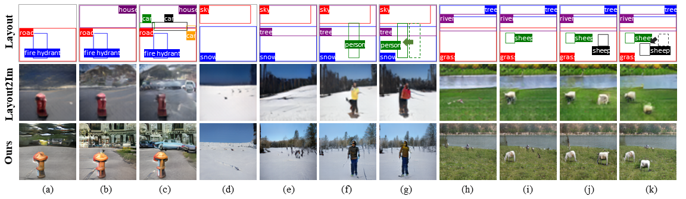
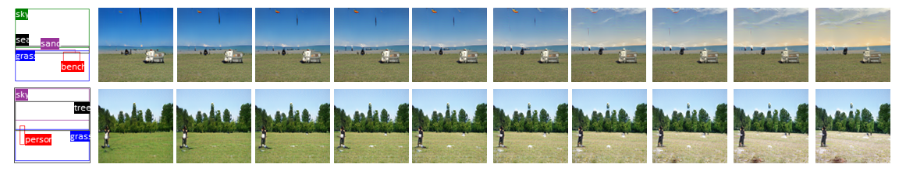
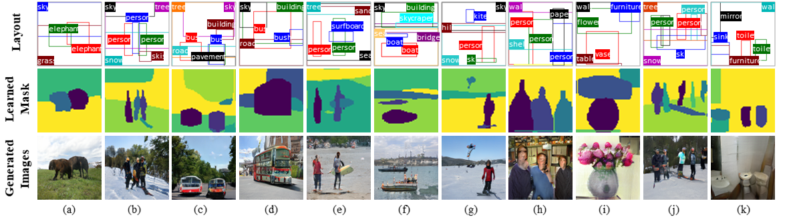

# LostGANs: Image Synthesis From Reconfigurable Layout and Style
This is implementation of our ICCV19 paper [**Image Synthesis From Reconfigurable Layout and Style**](https://arxiv.org/abs/1908.07500)

## Network Structure


## Installation
Check [INSTALL.md](INSTALL.md) for installation instructions.
#### 1. Download pretrained model
Download pretrained models to `pretrained_model/`
* Pretrained model on [COCO](https://drive.google.com/open?id=1WO6fLZqJeTUnmJTmieUopKLj9KGBhGd6)
* Pretrained model on [VG](https://drive.google.com/open?id=1A_gP_WwZWonlXJhwcdBDgHuVaGSiVjMO)

#### 2. Train models
```
python train.py --dataset coco --out_path outputs/
```

#### 3. Run pretrained model
```
python test.py --dataset coco --model_path pretrained_model/G_coco.pth --sample_path samples/coco/
```


## Results
###### Multiple samples generated from same layout

###### Generation results by adding new objects or change spatial position of object

###### Linear interpolation of instance style

###### Synthesized images and learned masks for given layout


## Contact
Please feel free to report issues and any related problems to Wei Sun (wsun12 at ncsu dot edu) and Tianfu Wu (tianfu_wu at ncsu dot edu).


## Reference
* Synchronized-BatchNorm-PyTorch: [https://github.com/vacancy/Synchronized-BatchNorm-PyTorch](https://github.com/vacancy/Synchronized-BatchNorm-PyTorch)
* Image Generation from Scene Graphs: [https://github.com/google/sg2im](https://github.com/google/sg2im)
* Faster R-CNN and Mask R-CNN in PyTorch 1.0: [https://github.com/facebookresearch/maskrcnn-benchmark](https://github.com/facebookresearch/maskrcnn-benchmark)
